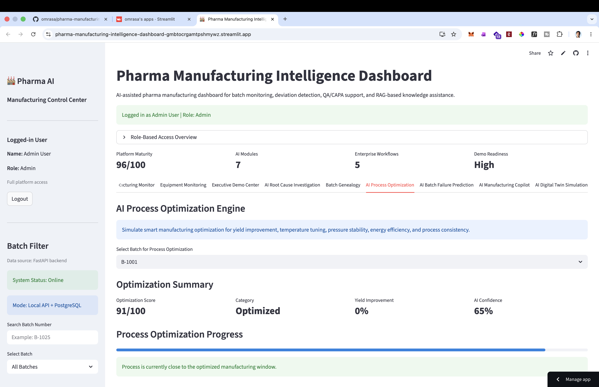
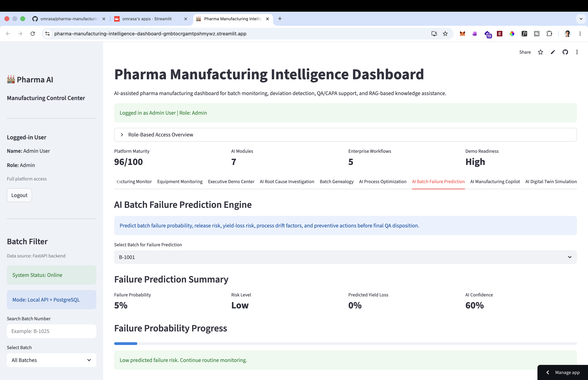
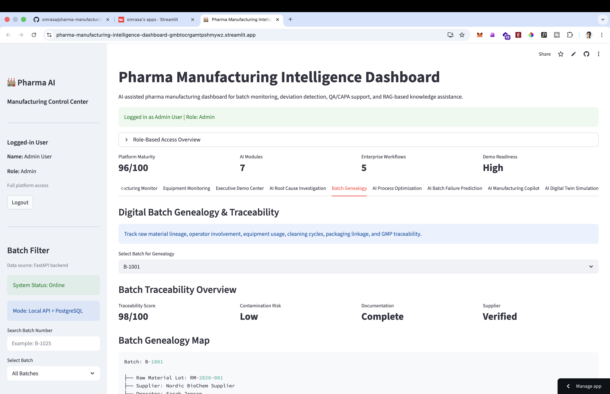
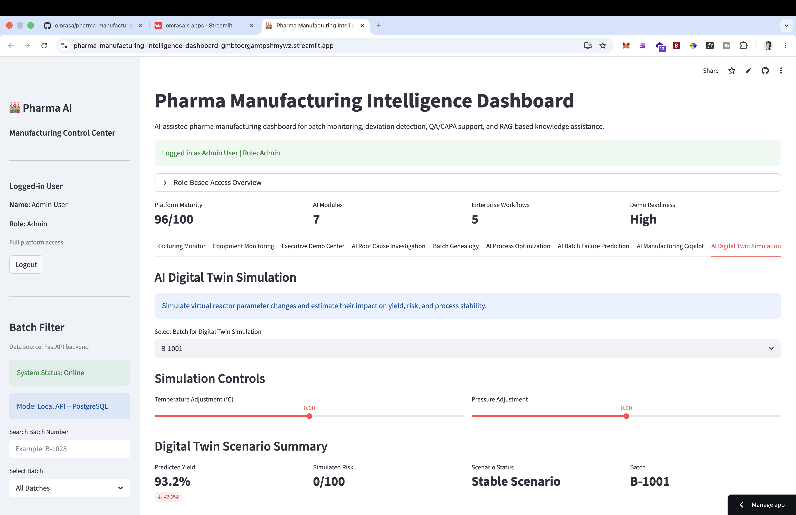
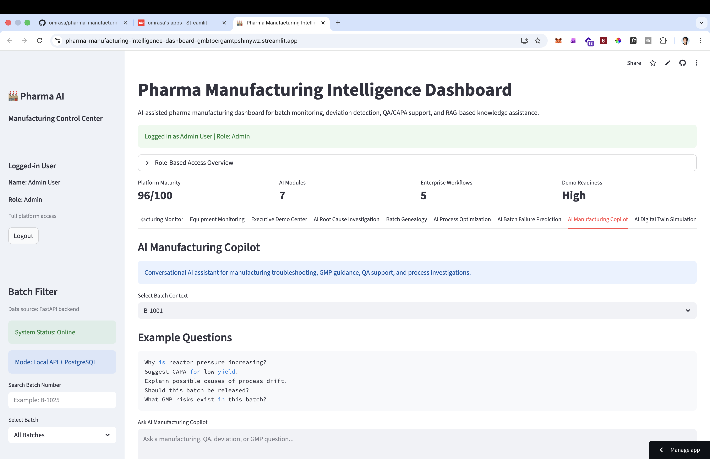

# 🏭 Pharma Manufacturing Intelligence Platform

AI-assisted pharmaceutical manufacturing intelligence platform for batch monitoring, deviation detection, QA/CAPA support, predictive analytics, and digital manufacturing operations.

---

# 🚀 Live Demo

### Streamlit Cloud Deployment
https://pharma-manufacturing-intelligence-dashboard-gmbtocrgamtpshmywz.streamlit.app

---

# 📌 Project Overview

This project demonstrates a modern pharma manufacturing intelligence system combining:

- AI-assisted manufacturing analytics
- GMP-oriented batch monitoring
- QA / CAPA workflows
- Batch genealogy & traceability
- Root cause investigation
- Failure prediction
- Digital twin simulation
- AI manufacturing copilot
- FastAPI + Streamlit architecture
- PostgreSQL-backed process intelligence

The platform simulates how modern pharmaceutical manufacturing environments can leverage AI and digitalization to improve:

- product quality
- process stability
- compliance
- operational efficiency
- risk mitigation

---

# 🧠 Key Features

## 📊 Executive Manufacturing Dashboard

- Real-time KPI monitoring
- Manufacturing health overview
- Risk alerts
- QA review queue
- Critical batch monitoring

---

## ⚠️ AI Deviation Detection

- Automatic process deviation analysis
- Risk scoring
- GMP alert generation
- Batch anomaly identification

---

## 🔍 AI Root Cause Investigation

- AI-assisted root cause analysis
- CAPA guidance
- Process parameter investigation
- Release recommendation logic

---

## ⚙️ AI Process Optimization

- Yield optimization simulation
- Temperature & pressure tuning
- Process efficiency scoring
- Manufacturing optimization engine

---

## 📉 AI Batch Failure Prediction

- Failure probability estimation
- Risk-level prediction
- Predicted yield-loss analysis
- Preventive QA insights

---

## 🧬 Batch Genealogy & Traceability

- Raw material lineage
- Operator tracking
- Equipment linkage
- GMP traceability simulation

---

## 🧪 AI Digital Twin Simulation

- Virtual reactor simulation
- Process scenario modeling
- Parameter sensitivity analysis
- Stability simulation

---

## 🤖 AI Manufacturing Copilot

- Conversational manufacturing assistant
- GMP support guidance
- QA investigation assistance
- Process troubleshooting support

---

# 🏗️ System Architecture

```text
                ┌────────────────────┐
                │    Streamlit UI    │
                │ Enterprise Frontend│
                └─────────┬──────────┘
                          │
                          ▼
                ┌────────────────────┐
                │     FastAPI API    │
                │ Business Logic Layer│
                └─────────┬──────────┘
                          │
                          ▼
                ┌────────────────────┐
                │    PostgreSQL DB   │
                │ Batch & GMP Data   │
                └─────────┬──────────┘
                          │
                          ▼
                ┌────────────────────┐
                │   AI/Analytics     │
                │ Prediction Engine  │
                └────────────────────┘
```

---

# 🛠️ Technology Stack

| Layer | Technology |
|---|---|
| Frontend | Streamlit |
| Backend API | FastAPI |
| Database | PostgreSQL |
| ORM | SQLAlchemy |
| Language | Python |
| Data Processing | Pandas |
| Visualization | Plotly |
| AI/RAG | ChromaDB |
| Deployment | Streamlit Cloud |
| Version Control | Git + GitHub |

---

# 📸 Platform Screenshots

## Enterprise Login


---

## Executive Manufacturing Dashboard


---

## AI Root Cause Investigation


---

## AI Process Optimization



---

## AI Batch Failure Prediction



---

## Batch Genealogy & Traceability



---

## AI Digital Twin Simulation



---

## AI Manufacturing Copilot



---

# 🧪 Example Use Cases

- Smart manufacturing monitoring
- GMP digitalization
- QA deviation investigation
- Batch release support
- Process optimization simulation
- Predictive manufacturing analytics
- Manufacturing risk assessment
- Pharma AI innovation demonstration

---

# 🔐 Enterprise Concepts Demonstrated

- Role-based access control
- QA review workflows
- CAPA logic simulation
- Manufacturing risk scoring
- Digital traceability
- Batch monitoring systems
- AI-assisted decision support

---

# 📦 Local Installation

## Clone Repository

```bash
git clone https://github.com/omrasa/pharma-manufacturing-intelligence-dashboard.git
cd pharma-manufacturing-intelligence-dashboard
```

---

## Create Virtual Environment

```bash
python -m venv pharma_env
```

---

## Activate Environment

### Mac/Linux

```bash
source pharma_env/bin/activate
```

### Windows

```bash
pharma_env\Scripts\activate
```

---

## Install Dependencies

```bash
pip install -r requirements.txt
```

---

## Run FastAPI Backend

```bash
uvicorn api:app --reload
```

---

## Run Streamlit Frontend

```bash
streamlit run streamlit_app.py
```

---

# 🌍 Future Enhancements

- Docker containerization
- Azure/AWS deployment
- Real-time sensor streaming
- LLM integration
- Advanced ML prediction models
- MES/SCADA simulation
- OPC-UA integration
- Automated PDF reporting
- Enterprise authentication

---

# 👨‍🔬 Author

Saif Ullah

PhD Chemist | GMP Manufacturing | AI & Data Analytics | Pharma Digitalization

---

# 📄 License

MIT License